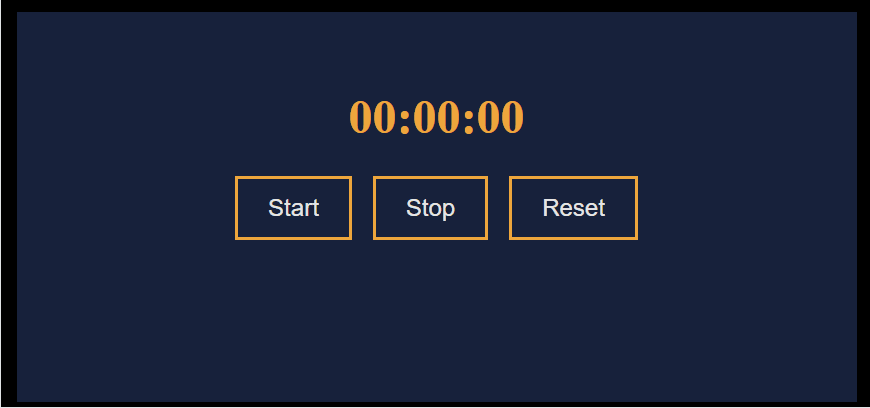

# Проект "Таймер"

## Описание проекта
Отсчитывайте время.

## Цели проекта
Пользователь может начать, остановить или перезапустить таймер.

## Используемые технологии
- `HTML` для разметки сайта и подключения JS и CSS.
- `CSS` для придания красок HTML.
- `JavaScript` для добавления интерактива в проект.

## Функции проекта
- `formatTime(time)` - нужна для форматирования времени. На вход принимает само время, проверяет, если оно меньше 10, то добавляет слева 0, чтобы число оставалось двузначным, иначе, оставляет как есть.
- `increamentTimer()` - нужна для прибавления ко времени еденицы с помощью инкримента (повышения значения на 1), далее проверяет, если секунд 60, что равняется одной минуте, обнуляет секунды и прибавляет к минутам еденицу. Тоже самое, если минут 60, что равняется одному часу, обнуляет минуты и прибавляет к часам еденицу.
- `startTimer()` - нужна для запуска таймера, после каждого инкримента задает интервал в 1000 милисекунд, если таймер не включен или остановлен (не выполняется условие `timerOn`).
- `stopTimer()` - нужна для остановки таймера, если таймер запущен она перестает выполнять интервал (при выполнении условия `timerOn`).
- `resetTimer()` - нужна для сброса таймера, если таймер запущен она выполняет функцию `stopTimer()`, затем сбрасывает весь таймер и выводит 00:00:00.

## Пример использования
- если вы хотите запустить таймер нажмите на кнопку `Start`.
- если вы хотите остановить таймер нажмите на кнопку `Stop`.
- если вы хотите сбросить таймер нажмите на кнопку `Reset`.

### Проект выполнен в образовательных целях на онлайн-курсе "Основы Веб-разработки" школы "Лидер".

